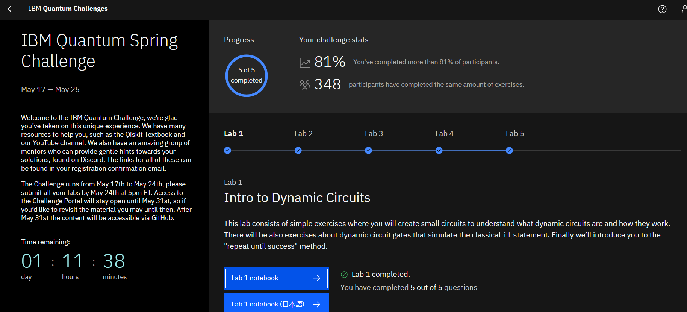
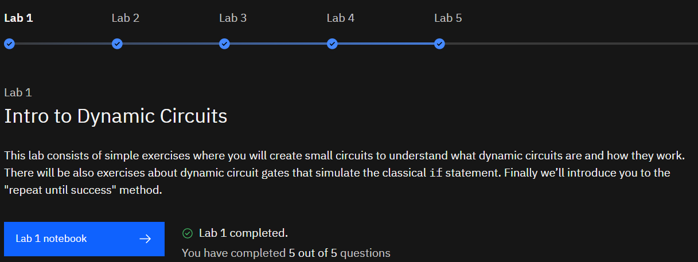
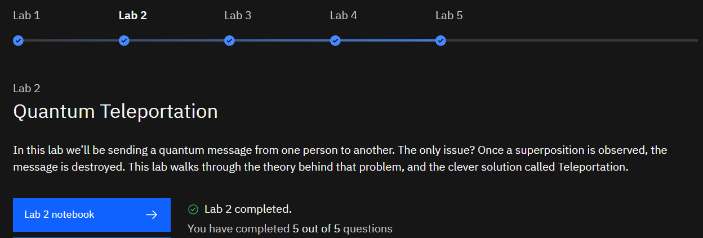
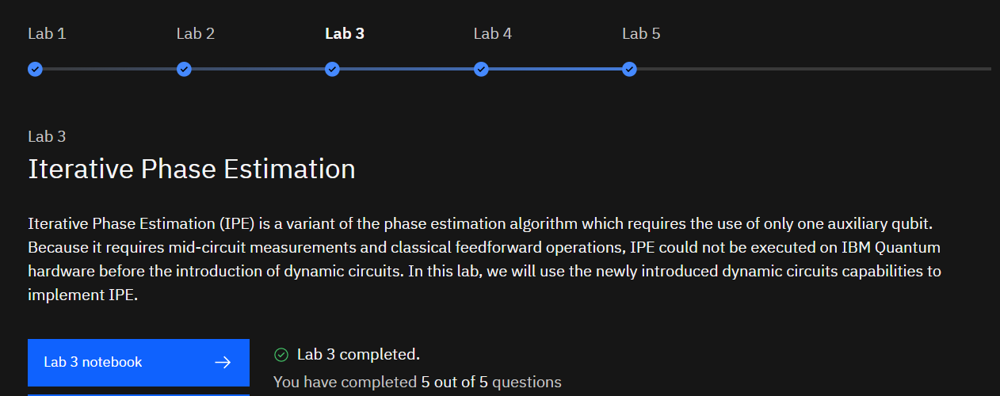
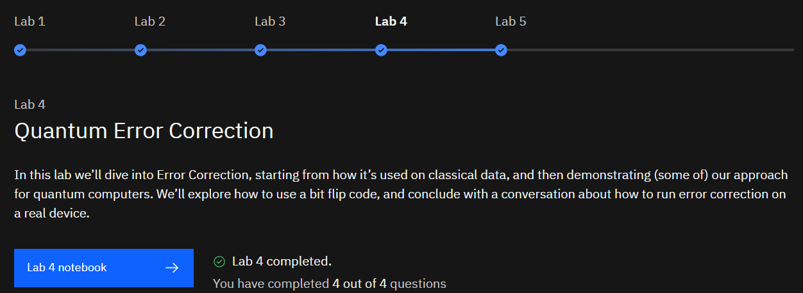
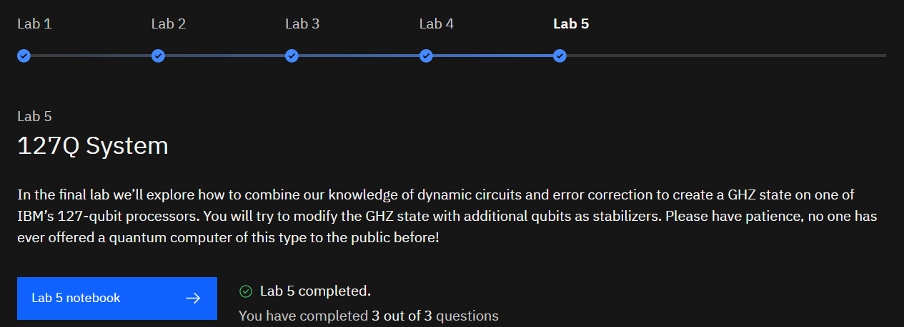

# IBM Quantum Spring Challenge 2023

**May 17 — May 25**

Welcome to the IBM Quantum Challenge, we’re glad you’ve taken on this unique experience. We have many resources to help you, such as the [Qiskit Textbook](https://qiskit.org/learn/) and our [YouTube channel](https://www.youtube.com/Qiskit). We also have an amazing group of mentors who can provide gentle hints towards your solutions, found on Discord. The links for all of these can be found in your registration confirmation email.

The Challenge runs from May 17th to May 24th, please submit all your labs by May 24th at 5pm ET. Access to the Challenge Portal will stay open until May 31st, so if you’d like to revisit the material you may until then. After May 31st the content will be accessible via GitHub.

---

## Lab 1 : Intro to Dynamic Circuits : [Notebook](https://nbviewer.org/github/ashishpatel26/IBM-Quantum-Challenge-Spring-2023-Challenge/blob/main/Code/lab1.ipynb)

This lab consists of simple exercises where you will create small circuits to understand what dynamic circuits are and how they work. There will be also exercises about dynamic circuit gates that simulate the classical `if` statement. Finally we’ll introduce you to the "repeat until success" method.

---

## Lab 2 : Quantum Teleportation : [Notebook](https://nbviewer.org/github/ashishpatel26/IBM-Quantum-Challenge-Spring-2023-Challenge/blob/main/Code/lab2.ipynb)

In this lab we’ll be sending a quantum message from one person to another. The only issue? Once a superposition is observed, the message is destroyed. This lab walks through the theory behind that problem, and the clever solution called Teleportation.

---

## Lab 3 : Iterative Phase Estimation : [Notebook](https://nbviewer.org/github/ashishpatel26/IBM-Quantum-Challenge-Spring-2023-Challenge/blob/main/Code/lab3.ipynb)

Iterative Phase Estimation (IPE) is a variant of the phase estimation algorithm which requires the use of only one auxiliary qubit. Because it requires mid-circuit measurements and classical feedforward operations, IPE could not be executed on IBM Quantum hardware before the introduction of dynamic circuits. In this lab, we will use the newly introduced dynamic circuits capabilities to implement IPE.

---

## Lab 4 : Quantum Error Correction : [Notebook](https://nbviewer.org/github/ashishpatel26/IBM-Quantum-Challenge-Spring-2023-Challenge/blob/main/Code/lab4.ipynb)

In this lab we’ll dive into Error Correction, starting from how it’s used on classical data, and then demonstrating (some of) our approach for quantum computers. We’ll explore how to use a bit flip code, and conclude with a conversation about how to run error correction on a real device.

---

## Lab 5 : 127Q System : [Notebook](https://nbviewer.org/github/ashishpatel26/IBM-Quantum-Challenge-Spring-2023-Challenge/blob/main/Code/lab5.ipynb)

In the final lab we’ll explore how to combine our knowledge of dynamic circuits and error correction to create a GHZ state on one of IBM’s 127-qubit processors. You will try to modify the GHZ state with additional qubits as stabilizers. Please have patience, no one has ever offered a quantum computer of this type to the public before!

### Thanks For Reading 🙏🙏🙏
